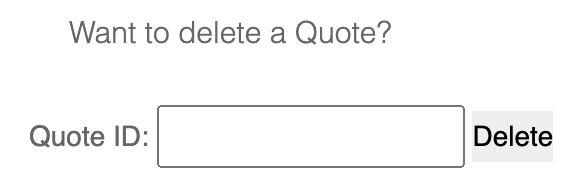

# dai-lab-http-infrastructure

# Step 1: Static Web site

In this step, we built a Docker image containing a static HTTP server using Nginx. The server serves a static Web site with a single page featuring a stylish template obtained from [Free-CSS](https://www.free-css.com/). The Dockerfile is based on the Nginx image and includes instructions to copy the static site content into the image.

To run the Docker image and access the static content, execute the following commands:
```
docker build -t dai-lab-http-infrastructure-static-server ./static-server
docker run -p 8080:80 dai-lab-http-infrastructure-static-server
```
Access the static site by opening your browser and navigating to http://localhost:80.

# Step 2: Docker Compose

I added a `docker-compose.yml` configuration file to the GitHub repository:

```yml
version: '3'

services:
  static-server:
    build:
      context: ./static-server
      dockerfile: Dockerfile
    ports:
      - "8080:80"
```
This configuration defines a service named static-server, builds the Docker image using the specified Dockerfile, and maps port 8080 on the host to port 80 on the container.
To start the infrastructure, use the following command:

```
docker-compose up -d
```
To stop the infrastructure:
```
docker-compose down
```
With the infrastructure running, you can access the static Web server by opening your browser and navigating to http://localhost:80

# Step 3: HTTP API Server

In this step, I've implemented a HTTP API server using Javalin. The API is designed to manage a list of quotes. It supports all CRUD operations (Create, Read, Update, Delete).
Implementation Overview
The main class of our API is Api, which contains the Javalin configuration and handles the CRUD operations.
Building with Maven
We have a Maven pom.xml file for managing dependencies and building the JAR.

To build the JAR with dependencies:
```
mvn clean package
```
To containerize our API server, we've created a Dockerfile.
We added the API server as a service in the Docker Compose configuration:
To start the API server using Docker Compose:
```
docker-compose up -d
```


# Step 4: Reverse proxy with Traefik

In this step, we introduce a reverse proxy using Traefik to efficiently manage and route requests to the respective static and dynamic web servers.
- We relay requests coming to "localhost" to the static HTTP server.
- We relay requests coming to "localhost/api" to the API server.
Access each server from the browser:

[Static Server](localhost)
[API Server](localhost/api)
[Traefik Dashboard](localhost/8080)


# Step 5: Scalability and load balancing

The deploy section is added to both api-server and static-server services. It specifies the desired number of replicas for each service (in this case, 3). You can adjust the replicas value based on your needs.
The feature is one by the following addition to the docker compose:
```
deploy:
 replicas: 3
```
To scale up or down the api-server/static-server, you can run:
```
docker-compose up -d --scale api-server= #of services
docker-compose up -d --scale static-server= #of services
docker ps
```
The docker ps command is the check on the terminal what was launched.
# Step 6: Load balancing with round-robin and sticky sessions
```
curl -I -H "Host: localhost" http://localhost/index.html
docker-compose logs -f static-server
```
on the Traefik dashboard, under HTTP Services, for api-server-dai-lab-http-infrastructure@docker we see 5 and for static-server-dai-lab-http-infrastructure@docker we see 3.

# Optional Step 1: Management UI (Using Portainer)

In this project, I've opted to enhance the management and monitoring of the web infrastructure using Portainer. Portainer is a user-friendly and powerful container management tool that provides a convenient web interface for Docker. It simplifies Docker container orchestration and makes it easier to visualize, manage, and update containers.

To access it go to http://localhost:9000.
```
Username: adminDAI
Password: VU$F438Tjju!sHJ
```
Once you've accessed Portainer, you gain a powerful interface for managing the Docker containers. The dashboard offers a comprehensive overview of the containers, networks, and volumes, providing insights into the web infrastructure.

Navigate to the "Containers" section to view and manage the running containers.

Starting/Stopping Containers:

Start or stop containers with a simple click on the respective container in the Portainer interface.

# Optional Step 2: Integration API - static Web site

In the about.html page, I integrated the Quotes API, it displays the quotes added to the API.
Moreover, you can enter choose to delete a quote by entering the ID of the chosen quote:<br />

<br />
This was done by the following line in the API's main class:
```
app.before(ctx -> ctx.header("Access-Control-Allow-Origin", "*"));
```
And this is the Script used:
```html
<script>
        // Function to make a GET request to the API
        async function fetchData() {
            const response = await fetch('http://localhost/api/quotes');
            const data = await response.json();
            return data;
        }
        // Function to update the page with API results
        async function updatePage() {
            const apiResultElement = $('#apiResult');
            try {
                const data = await fetchData();

                if (data) {
                    apiResultElement.html(`
                        <h2>API Quotes:</h2>
                        <ul>
                            ${data.map(quote => `
                                <li>
                                    <strong>ID:</strong> ${quote.id}, 
                                    <strong>Author:</strong> ${quote.author}, 
                                    <strong>Content:</strong> ${quote.content}
                                </li>`).join('')}
                        </ul>
                        
                        <p>
                            Want to delete a Quote?
                        </p>
                        <form id="deleteForm" class="mt-4">
                            <label for="quoteId">Quote ID:</label>
                            <input type="text" id="quoteId" name="quoteId" required>
                            <button type="button" onclick="deleteQuote()">Delete</button>
                        </form>
                    `);
                } else {
                    apiResultElement.html('<p>Error: API data is null</p>');
                }
            } catch (error) {
                apiResultElement.html(`<p>Error: ${error.message}</p>`);
            }
        }

        // Function to delete a quote
        async function deleteQuote() {
            const quoteId = $('#quoteId').val();
            try {
                const response = await fetch(`http://localhost/api/quotes/${quoteId}`, {
                    method: 'DELETE',
                });

                if (response.ok) {
                    console.log(`Quote ${quoteId} deleted successfully.`);
                } else {
                    console.error(`Failed to delete quote ${quoteId}.`);
                }
                updatePage();
            } catch (error) {
                console.error('Error deleting quote:', error.message);
            }
        }

        // Periodically update the page
        setInterval(updatePage, 5000); // Update every 5 seconds
    </script>
  ```
